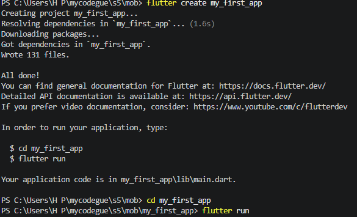
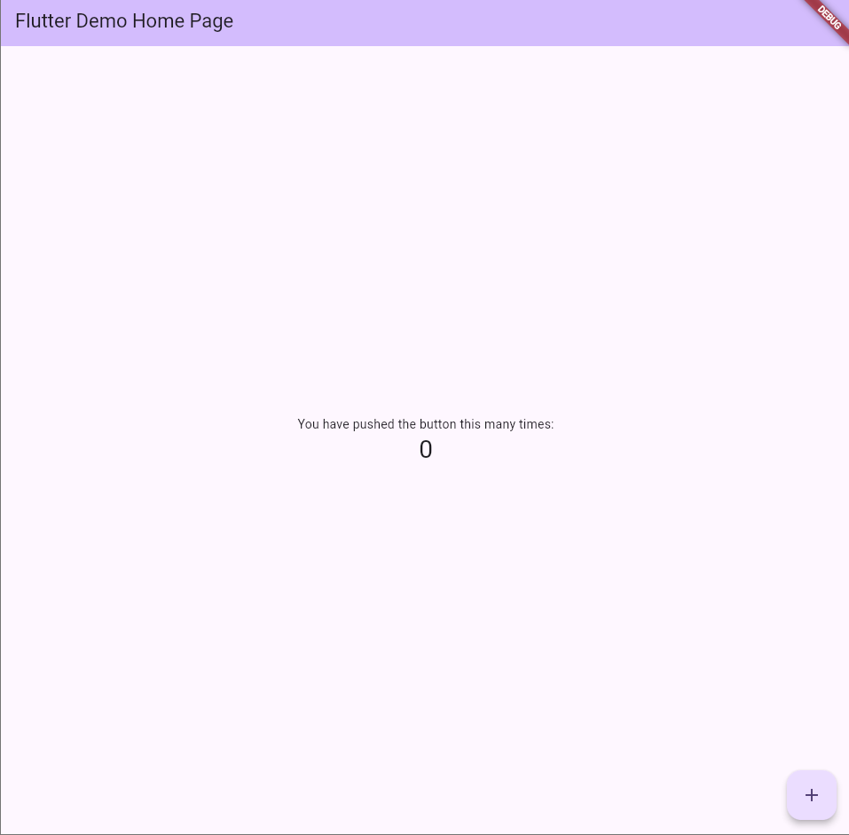
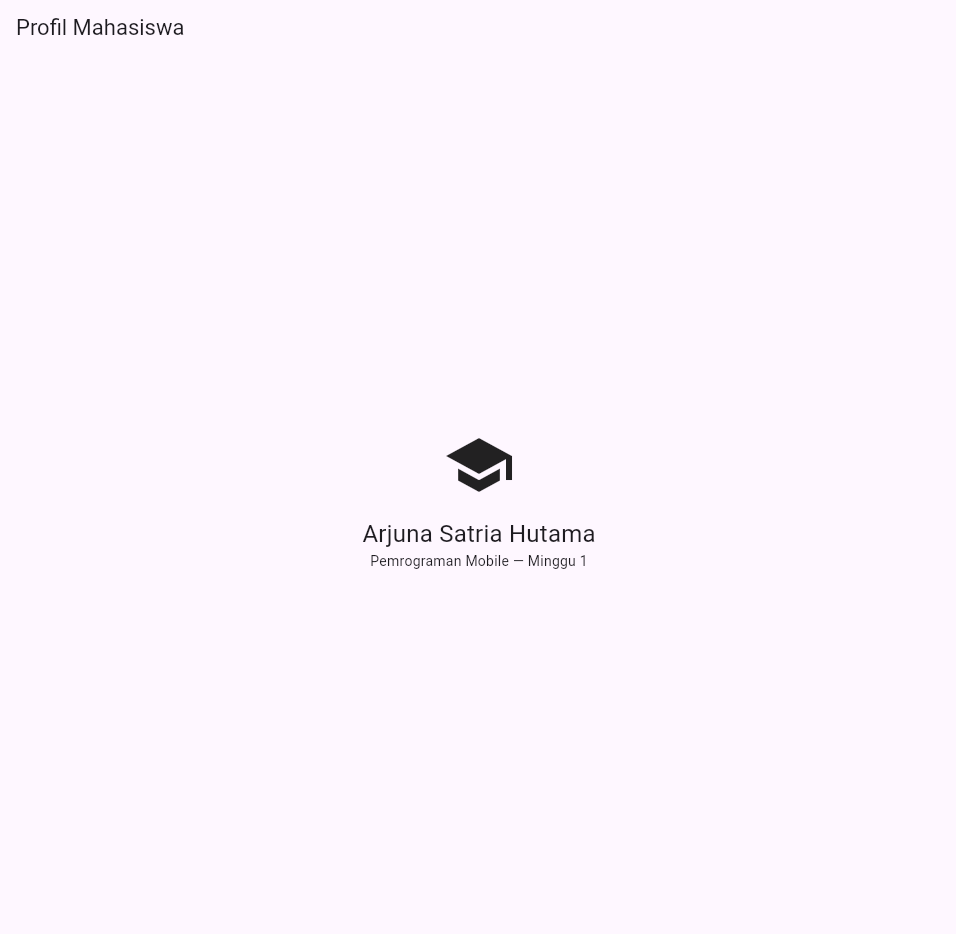
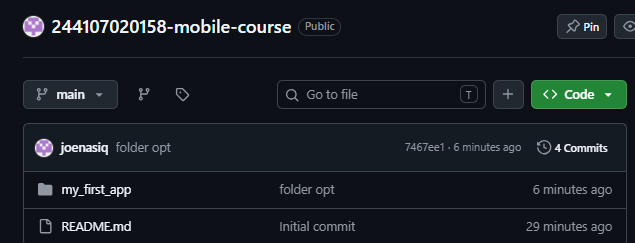
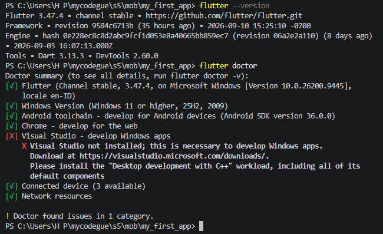
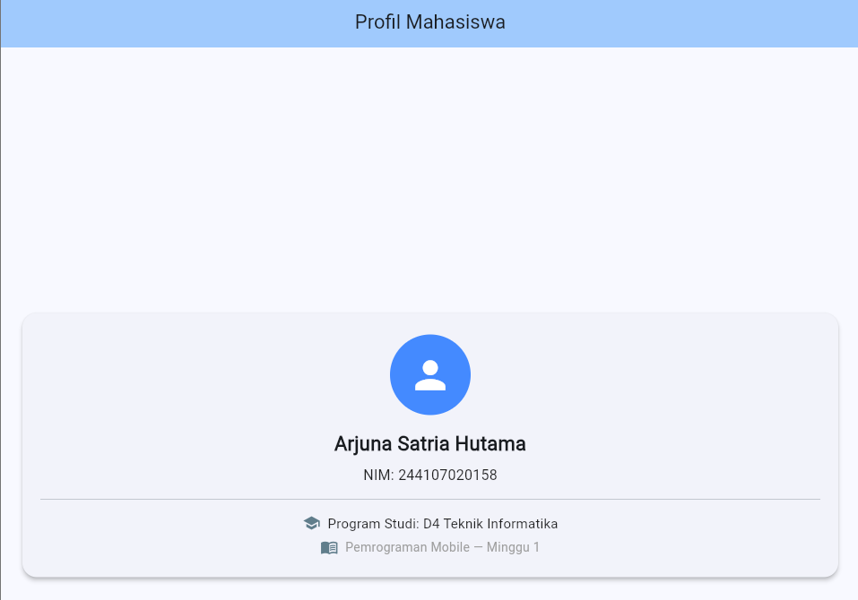

# WEEK 1: Mobile Development Ecosystem & Flutter Refresh

---

## Praktikum: Aplikasi Flutter Pertama

### Membuat dan Menjalankan Proyek

### Mengubah UI Default
- **Sebelum:**
  
  

- **Sesudah:**
  
  

---

## Git dan Portofolio

---

## Verifikasi, Tugas, dan Refleksi

### Checklist Verifikasi
- **Flutter Doctor:**
  
  

- **UI yang diganti dengan profil sederhana:**
  
  

- **Hot Reload:** Memperbarui tampilan tanpa mereset status (*state*) aplikasi.
- **Hot Restart:** Memulai ulang aplikasi dari awal dan mereset seluruh status (*state*) aplikasi.
- **Repository Remote:**
  
  

---

### Mini Assignment

---

### Refleksi
- **Kapan native lebih tepat dipilih daripada cross-platform?**  
  Native dipilih saat aplikasi membutuhkan akses perangkat keras/sensor kompleks.

- **Bagaimana perubahan state berhubungan dengan widget tree dan UI deklaratif?**  
  Saat state berubah, cabang widget tree terkait akan dibangun ulang untuk memperbarui tampilan antarmuka.

- **Mengapa commit kecil dengan pesan jelas bermanfaat bagi pekerjaan tim dan portfolio?**  
  - **Tim:** Mempermudah pelacakan bug, mempercepat code review, dan mencegah merge conflict.  
  - **Portofolio:** Menunjukkan alur kerja yang terstruktur dan profesional.