# WEEK 2: Declarative UI & Responsive Design

---

## Praktikum: layout sederhana (warm-up)

### membuat kartu profil sederhana
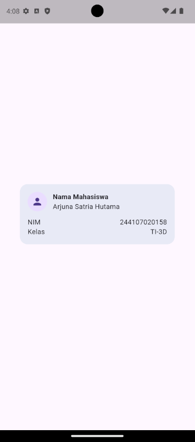

### eksperimen warmp-up
1. Hapus Expanded pada baris nama, lalu amati peringatan overflow atau perilaku layout-nya; kembalikan setelah itu.
**hapus extended**
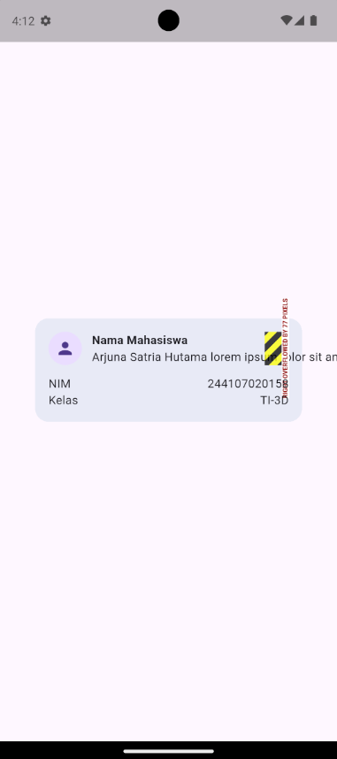
**undo extended**
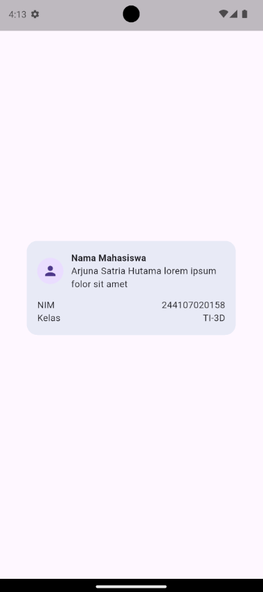

2. Ganti mainAxisSize: MainAxisSize.min menjadi nilai default dan amati perubahan tinggi kartu
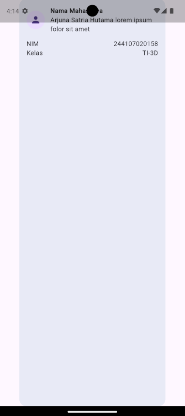

3. Tambahkan satu baris data (misal Email) menggunakan pola Row + Expanded yang sama
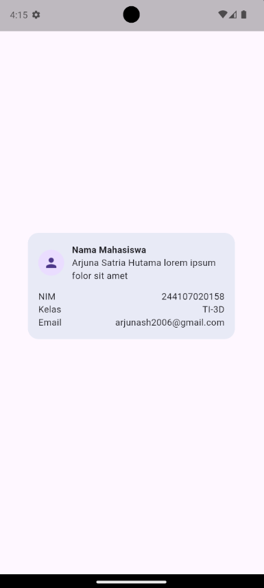

---

## Praktikum: dashboard responsif

### menyiapkan project
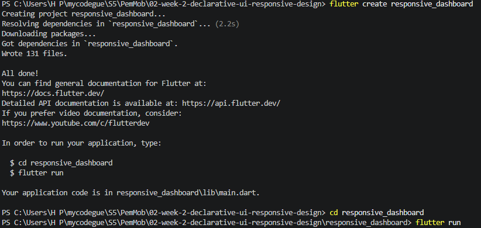
- **tampilan vertikal** 
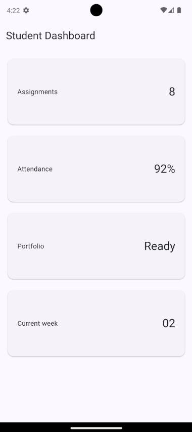
- **tampilan horizontal**
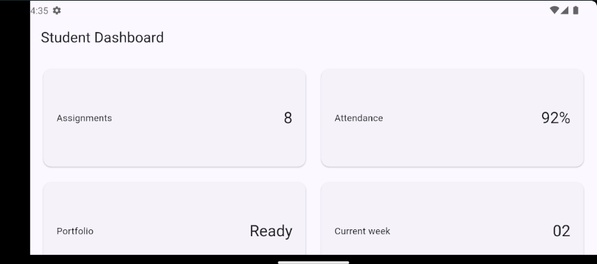

### Menambahkan interaksi: StatefulWidget dan Cupertino
- **tampilan vertikal** 
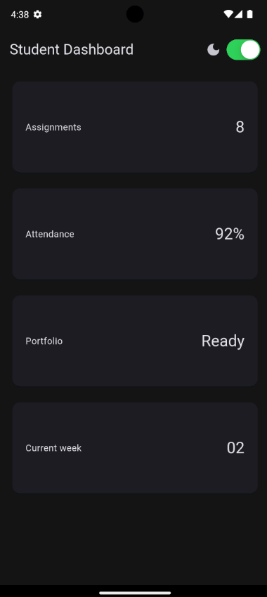
- **tampilan horizontal**
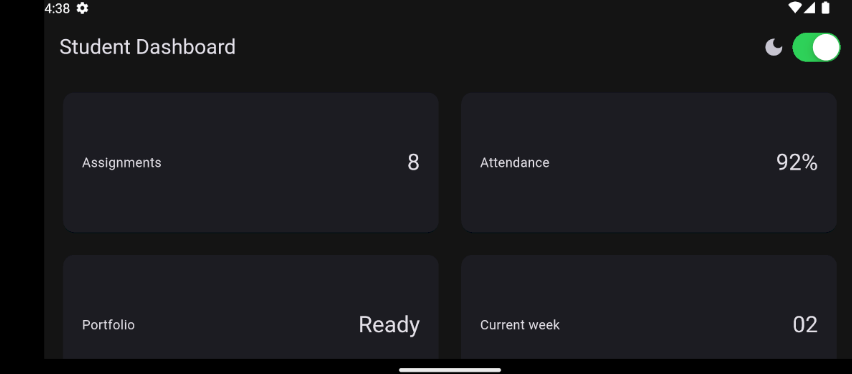

### eksperimen layout
1. Ubah breakpoint dari 700 menjadi nilai lain dan amati perubahan jumlah kolom
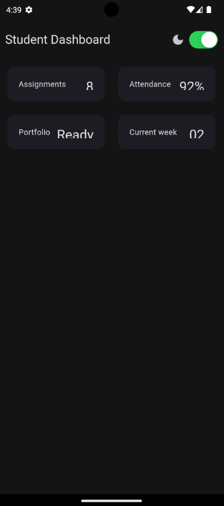
2. Ubah themeMode menjadi ThemeMode.dark, lalu kembalikan ke ThemeMode.system
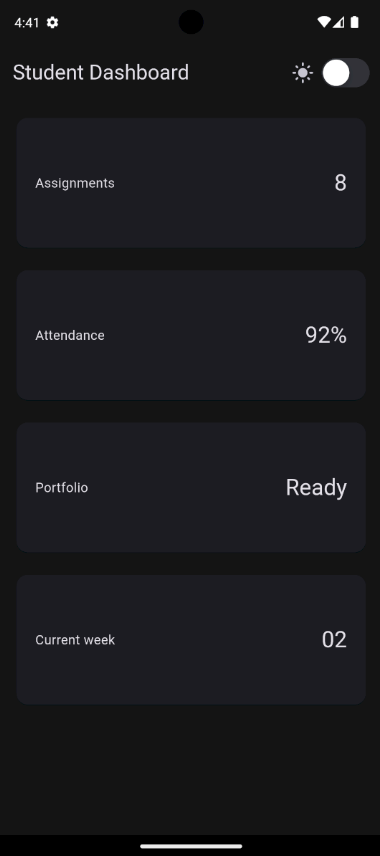

---

## Tugas dan AI design exploration

### Tugas utama
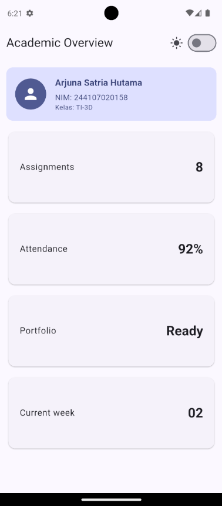
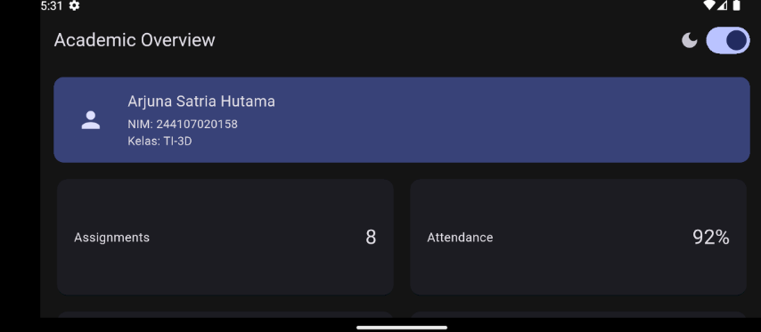

### AI Prompt Challenge
1. Promt desain: Bandingkan dua tata letak dashboard akademik untuk Flutter: versi GridView dan versi LayoutBuilder + Column. Jelaskan trade-off responsif dan aksesibilitasnya
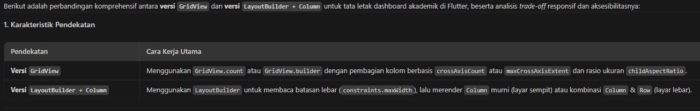
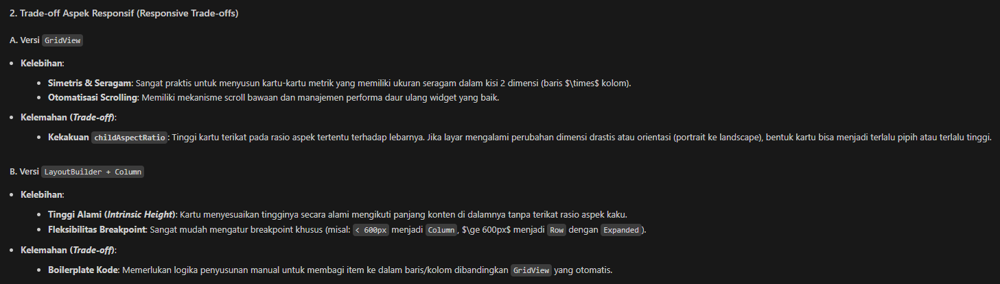
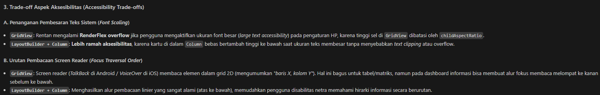
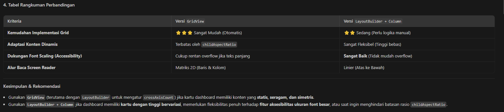

2. Prompt penguatan konsep: Jelaskan kapan penggunaan Expanded justru menyebabkan overflow di dalam Row, beri contoh kode yang gagal dan perbaikannya
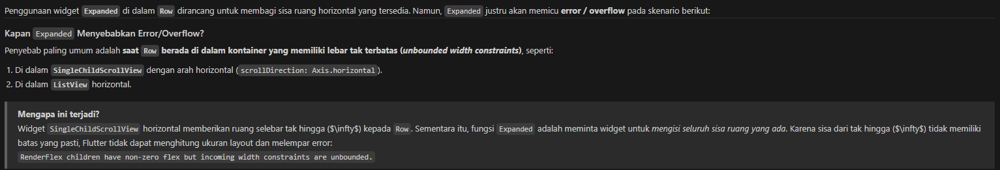
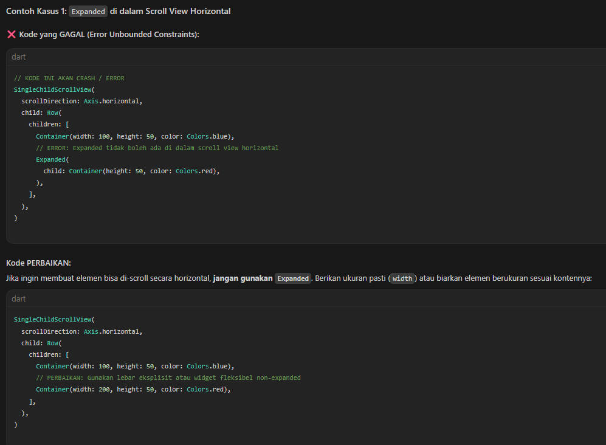
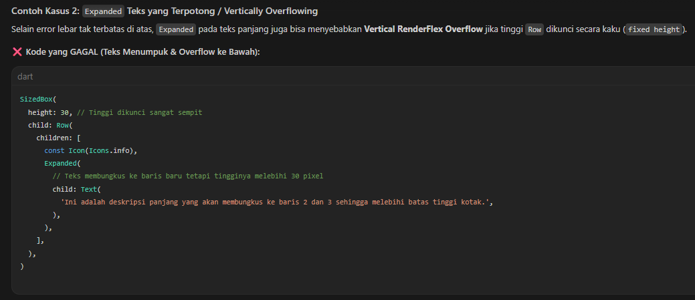
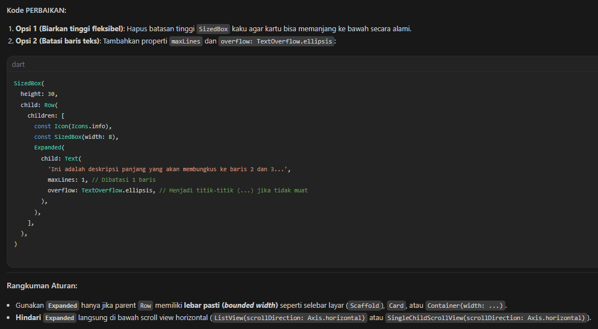

3. verification prompt: Periksa kembali rekomendasi layout di atas: apakah tetap responsif di bawah 600px, apakah mengurangi aksesibilitas, dan apakah ada widget yang tidak tersedia di Flutter stabil saat ini?
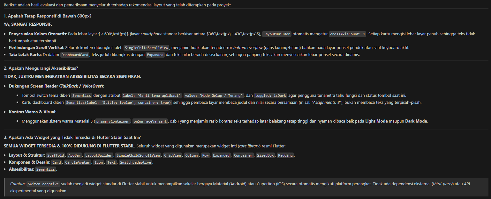

### Refactoring Challenge

1. Ekstrak kartu informasi menjadi widget reusable
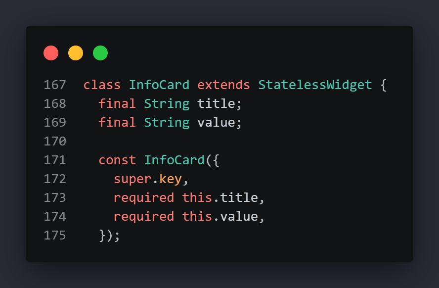
2. Ganti warna dan ukuran yang di-hardcode
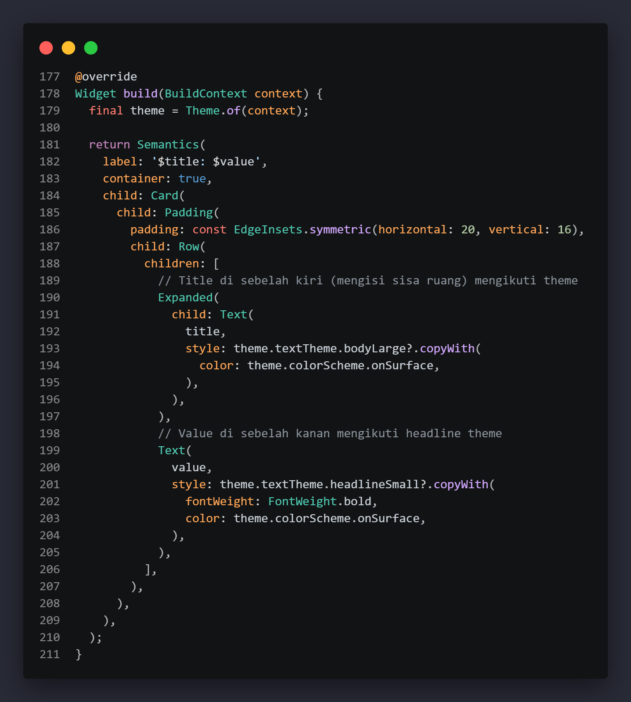
3. Pindahkan breakpoint ke satu konstanta
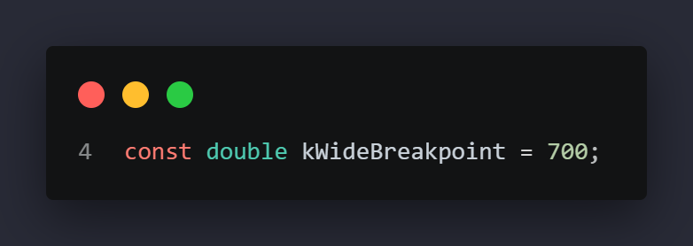
4. Jalankan flutter analyze
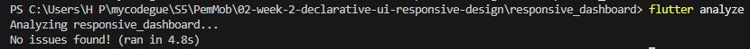

### testing dasar
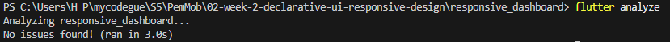

---

## Refleksi
- Apa perbedaan cara berpikir imperative dan declarative saat membangun UI?
imperatif: mengubah UI secara manual melalui instruksi
declarative: merender UI secara otomatis berdasarkan deskripsi state

- Kapan Expanded membantu dan kapan penggunaannya justru menghasilkan layout error?
Membantu membagi sisa ruang di dalam Row dan Column. mMnyebabkan layout error jika ditaruh di dalam wadah tanpa batasan ukuran

- Bagaimana breakpoint dan theme memengaruhi pengalaman pengguna?
breakpoint:menyesuaikan tata letak secara responsif
theme: menjaga konsistensi visual

- Apa yang Anda verifikasi dari rekomendasi AI setelah tugas inti selesai?
- kebenaran