# WEEK 3: Navigation & State Management

---

## Konsep navigasi dan GoRouter

### Praktikum 1 — Aplikasi multi-page dengan GoRouter
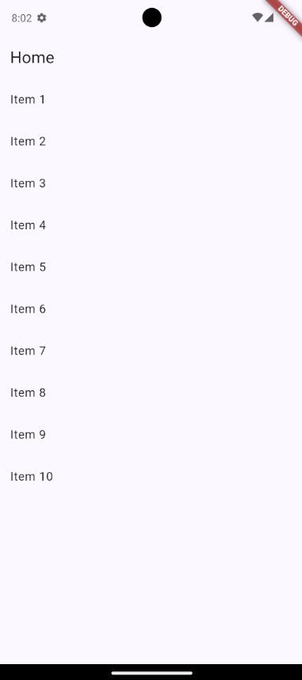
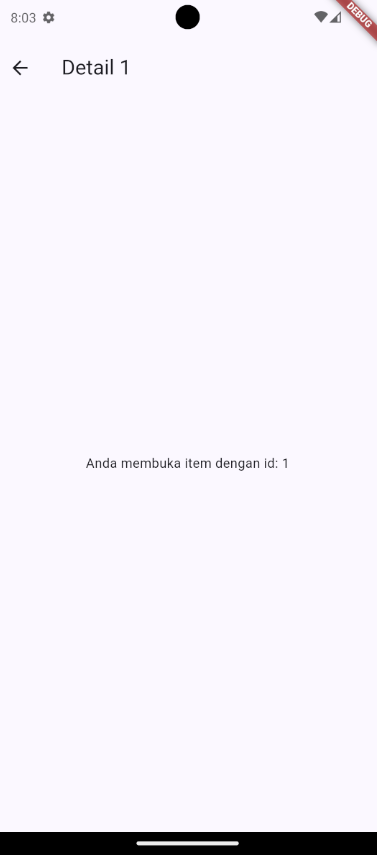

---

## State management dengan Riverpod

### Praktikum 2 — Aplikasi ToDo dengan Riverpod
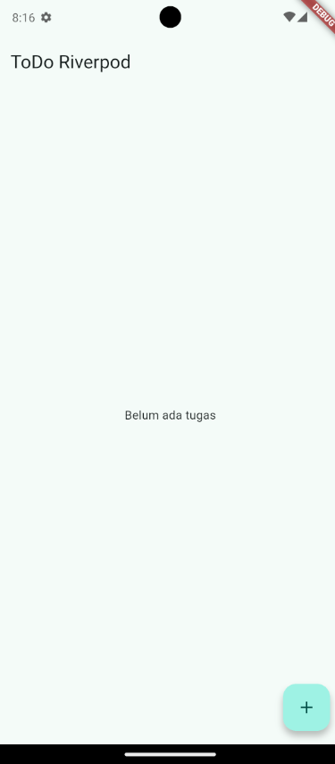
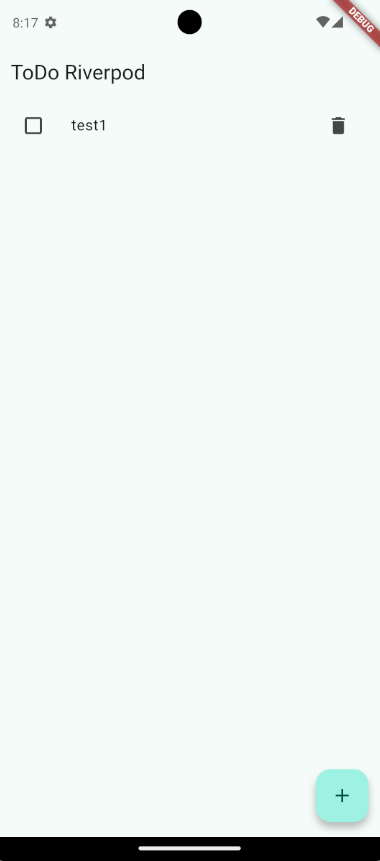

---

## AsyncValue: loading, error, success

### Praktikum 3 — Uji ketiga state
1. Salin kode di atas ke project ToDo Anda (atau project terpisah) dan jalankan. Amati tampilan loading selama 2 detik pertama.
    
    

2. Ubah build() sementara untuk melempar error: throw Exception('Gagal terhubung ke server');. Jalankan dan amati UI error beserta tombol Coba lagi.
    
    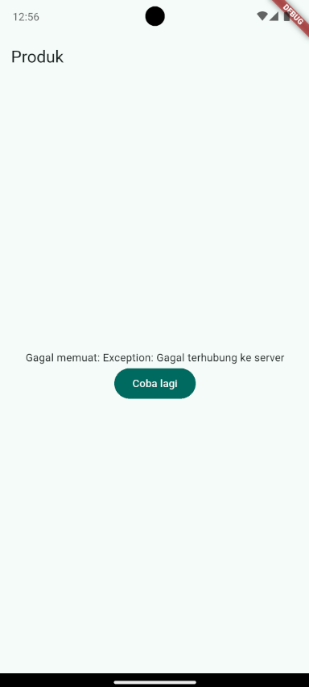

3. Tekan tombol Coba lagi, ref.invalidate membuat provider dijalankan ulang. Pulihkan kode, pastikan state success tampil.
    
    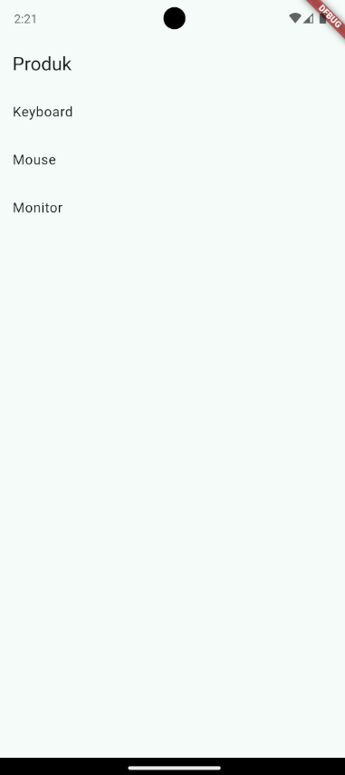

4. Refleksikan: mengapa menampilkan ulang data lama (stale data) dengan indikator refresh kadang lebih baik daripada mengosongkan layar? Kapan pola itu penting?
    
    Mengosongkan layar menyebabkan efek kedipan yang mengganggu saat data baru masuk. Menampilkan data lama membuat transisi visual menjadi jauh lebih halus

---

## Ai Challenge

### AI Prompt Challenge
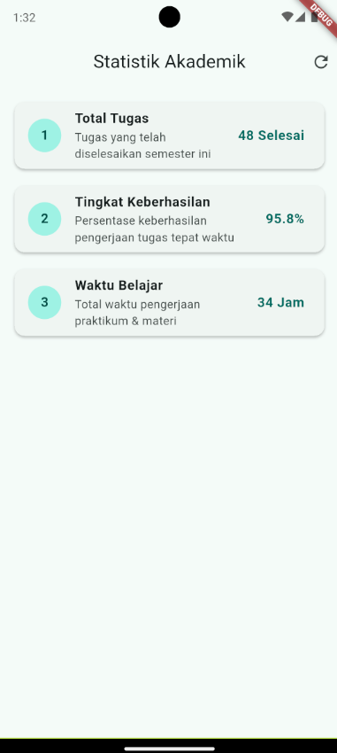

### AI Verification Checklist

- Apakah state diubah secara immutable (tidak ada state.add() atau mutasi list langsung)?
   
    **state diubah secara immutable. pada provider, Status asynchronous diganti secara immutable menggunakan state = const AsyncLoading(); dan state = await AsyncValue.guard(...).**

- Apakah ref.watch hanya dipakai di dalam build, dan ref.read di callback?
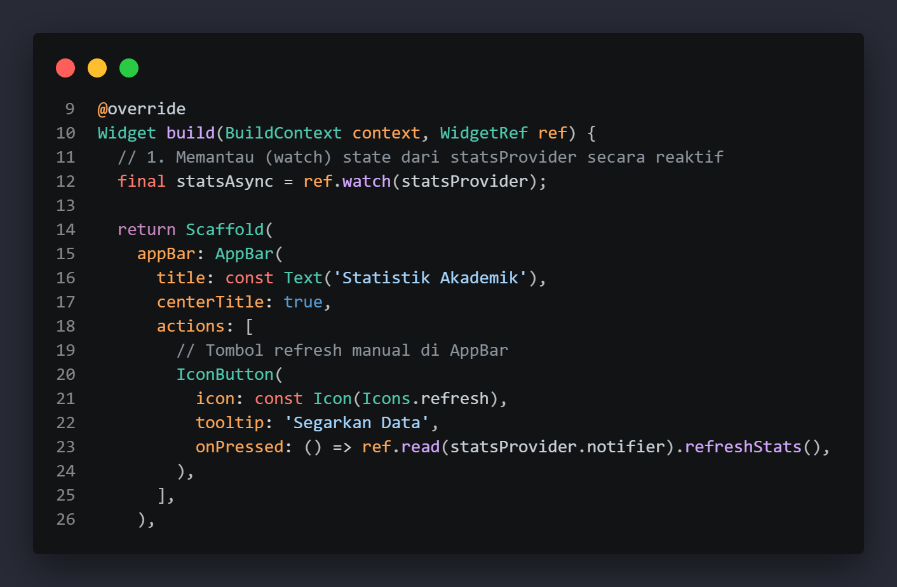

- Apakah ketiga state AsyncValue benar-benar ditangani (bukan hanya success)?
**ketiga state ditangani lengkap dengan ```.when```()**

- Apakah provider dideklarasikan dengan tipe eksplisit dan tidak duplikat dengan provider lain?
    
    **setiap provider memiliki generic type yang jelas dan dideklarasikan pada file terpisah**

- Apakah kode AI memakai API Riverpod versi lama (StateProvider antipattern, StateNotifierProvider usang, atau Consumer bertingkat yang tidak perlu)? Perbaiki ke pola Notifier/ConsumerWidget.
    
    **StateNotifierProvider relah diganti dengan arsitektur modern, seperti NotifierProvider dan AsyncNotifierProvider dan tidak ada consumer hell, CustomerWidget langsung di ekstensi pada class Page mendapatkan parameter WidgetRef ref secara bersih langsung di metode build(BuildContext context, WidgetRef ref)**

- Jalankan flutter analyze dan flutter test, apakah hasil AI lolos tanpa warning?
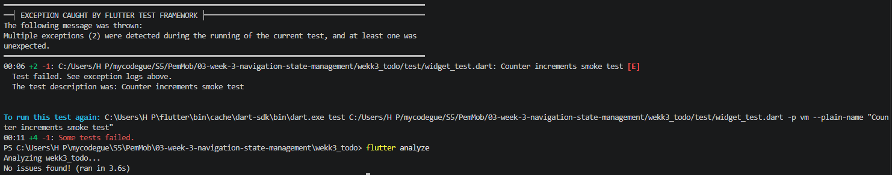

---

## Tugas, refleksi, dan referensi

### Mini project / Industry Challenge
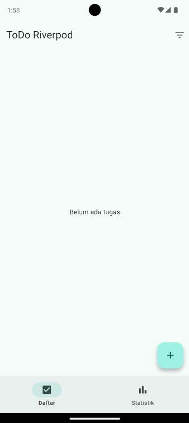
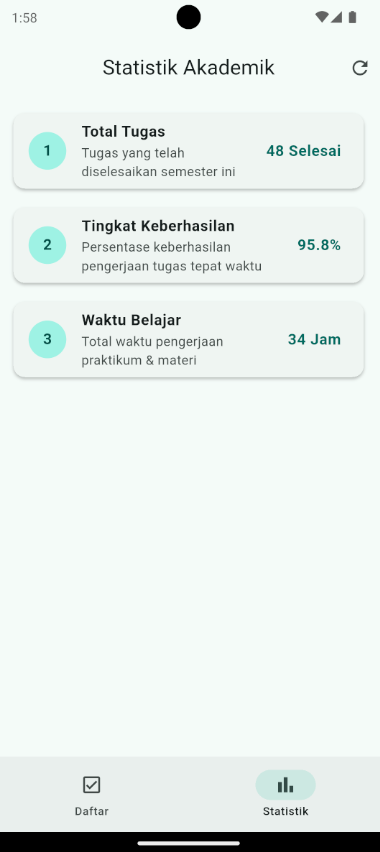
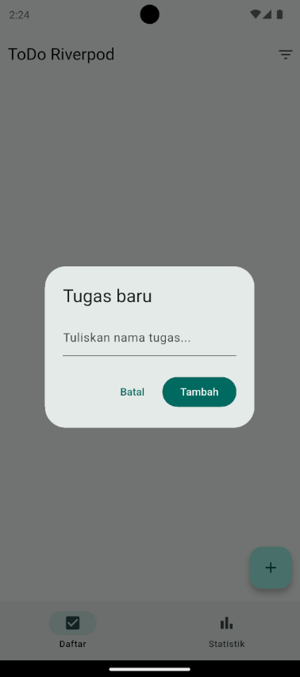
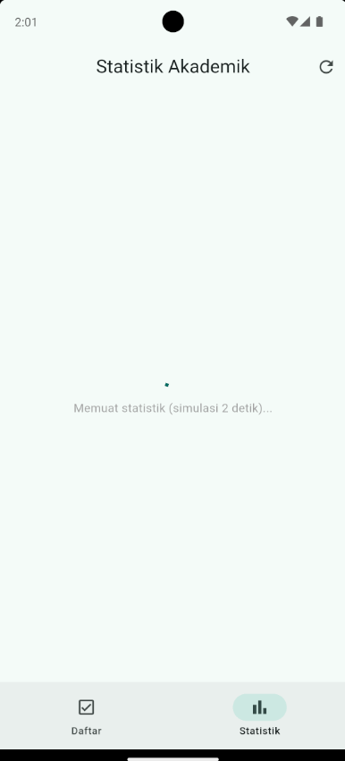
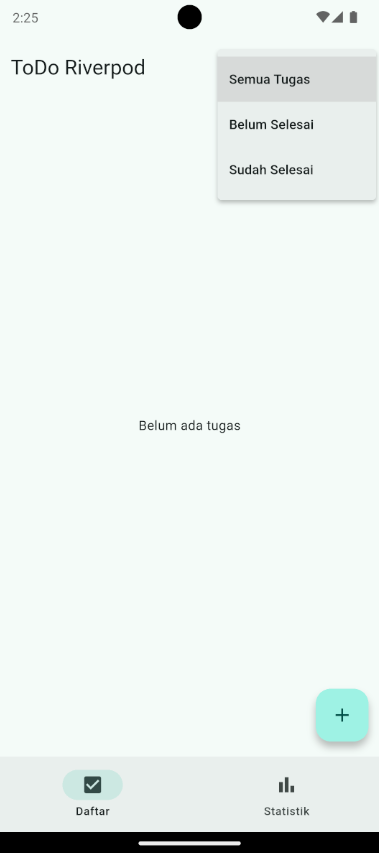

### refleksi 
- Kapan setState masih cukup, dan kapan state harus naik ke Riverpod?
    
    **setState untuk state lokal ephemeral satu widget**
    
    **Riverpod untuk state global, proses asinkron, atau dibagikan lintas halaman**

- Apa perbedaan context.go dan context.push, dan kapan masing-masing tepat digunakan?
    
    **go mengganti seluruh tumpukan navigasi**
    
    **push menumpuk halaman baru di atas halaman saat ini**

- Bagaimana AsyncValue mencegah bug dibanding tiga boolean terpisah?
    
    **AsyncValue Menjamin hanya satu status aktif, mengeliminasi bug akibat dua kondisi boolean aktif bersamaan**

- Bagian mana dari hasil AI yang Anda perbaiki, dan mengapa?
    
    **tidak ada, sudah bagus hehe**