# WEEK 4: Networking & REST API

---

## Praktikum 1: Dio dan model data
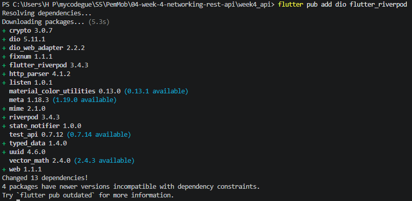

---

##  Praktikum 2: Provider dan error handling

1. Jalankan aplikasi dengan internet normal, amati loading lalu daftar 100 posts.
    
    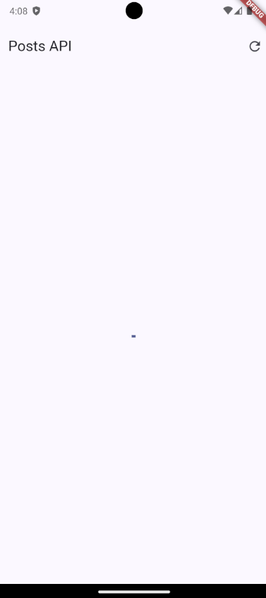
    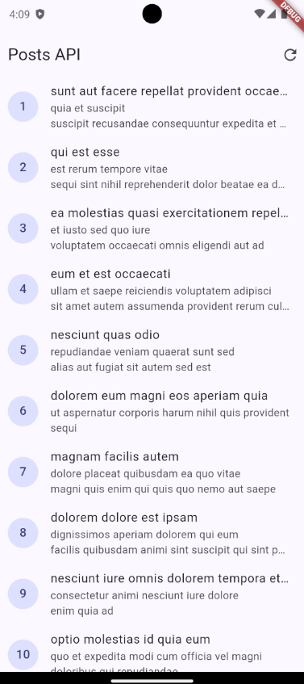
    

2. Matikan internet (mode pesawat), tekan refresh, amati pesan ramah + tombol Coba lagi. Nyalakan kembali internet, tekan Coba lagi.
 
    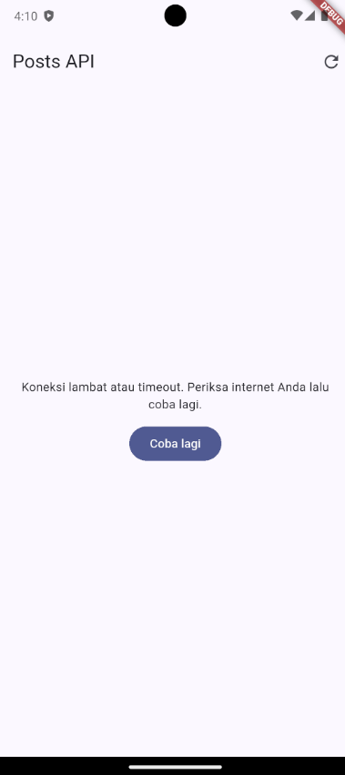
    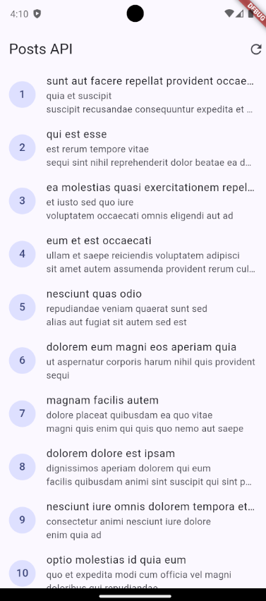

3. Sementara ubah baseUrl menjadi URL salah, amati pesan error koneksi. Kembalikan setelah uji.

    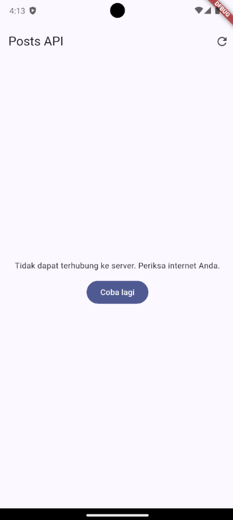

---

## Praktikum 3: Pagination dasar
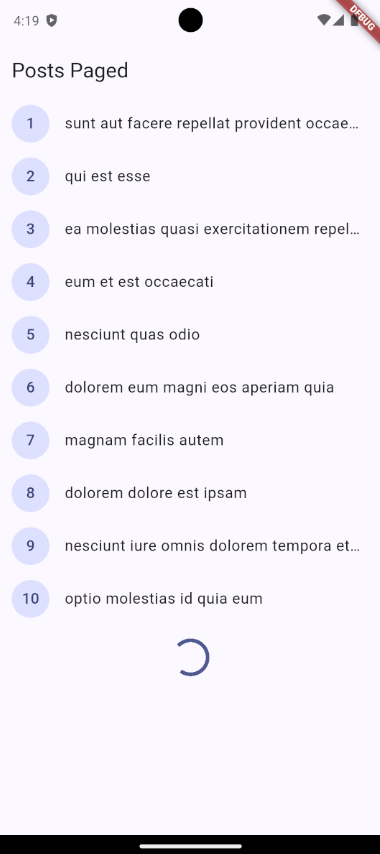

---

## AI Challenge

- Apakah UI memanggil Dio secara langsung (dilarang) atau lewat repository?

    **`lib/pages/` hanya memanggil `ref.watch(postListProvider)` atau `ref.watch(commentsProvider(id))` melalui widget `ConsumerWidget`. UI sama sekali tidak mengimpor `package:dio/dio.dart`**

- Apakah fromJson aman null, atau masih memakai cast langsung yang bisa crash?

    **fromJson aman null karena menggunakan safe casting & fallback**

- Apakah semua tipe DioExceptionType (timeout, connectionError, badResponse) dipetakan ke pesan pengguna?

    **tipe `DioExceptionType` semuanya dipetakan pada fungsi `friendlyErrorMessage`**

- Apakah baseUrl/timeout terpusat di satu client, bukan tersebar di tiap method?

    **baseUrl/timeout terpusat di `api_client.dart`**

- Apakah test AI benar-benar menguji kasus field hilang, atau hanya happy path? Tambahkan minimal 1 edge case sendiri.

    **pada `test/comment_model_test.dart`, test case pertama secara sengaja mengirimkan JSON yang tidak lengkap, jadi AI menguji kasus field yang hilang & null**

- Jalankan flutter analyze dan flutter test, apakah hasil AI lolos tanpa warning?

    

---

## Refactoring dan testing
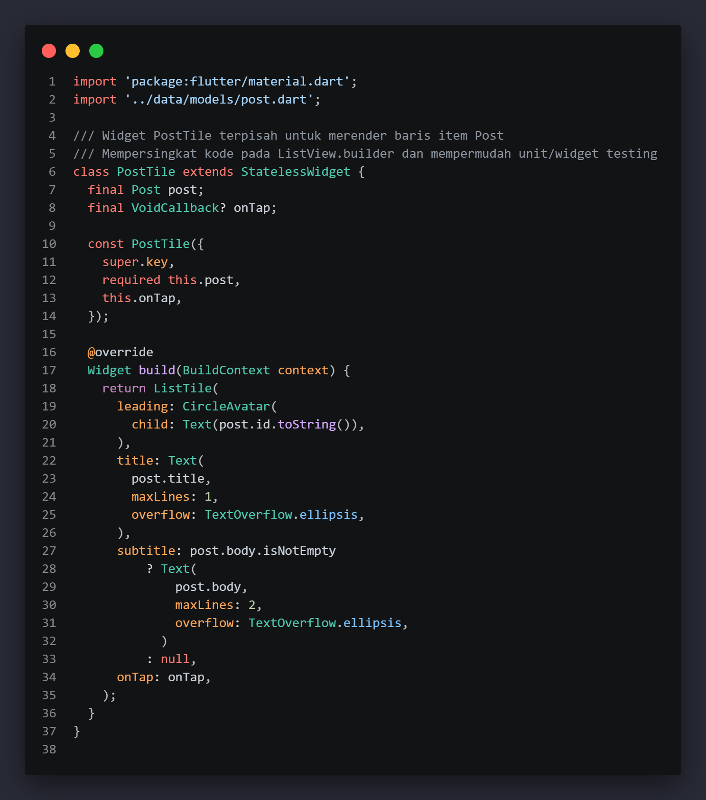
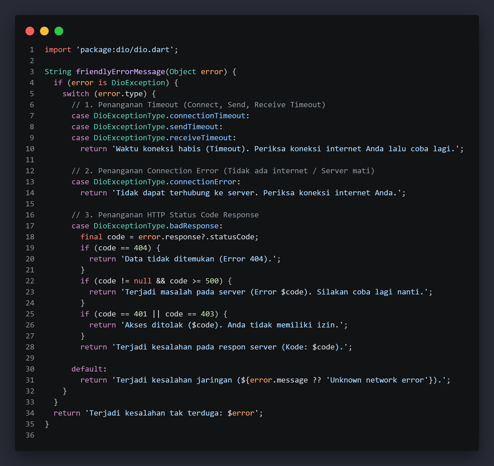
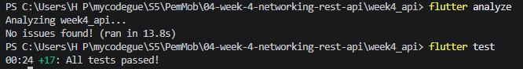

---

## Tugas dan refleksi

### Mini project / Industry Challenge

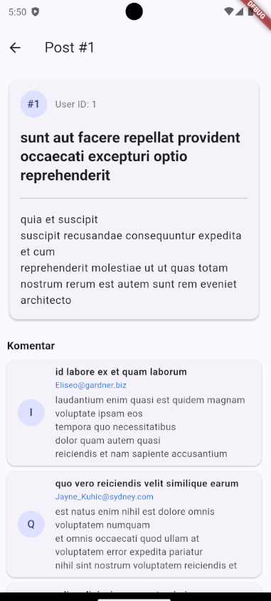
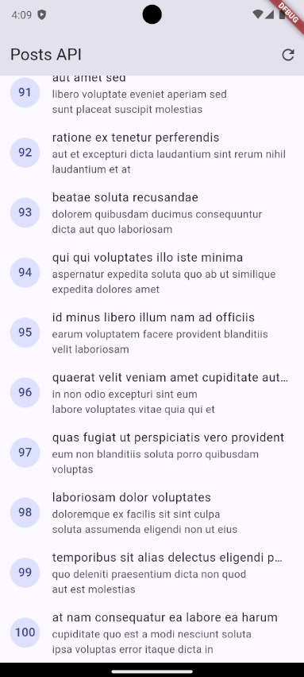
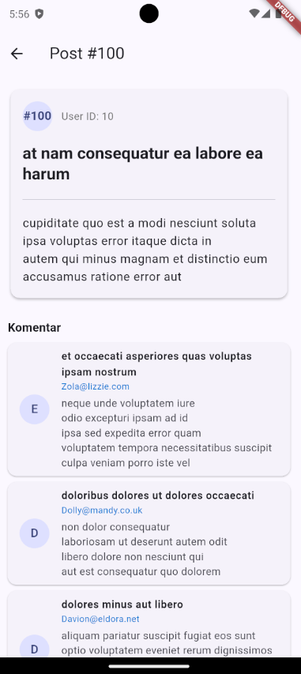
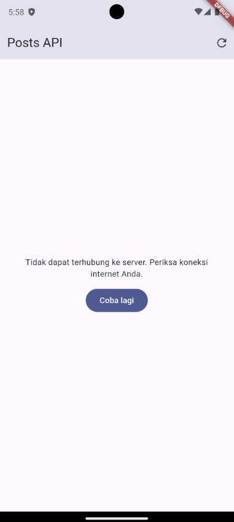
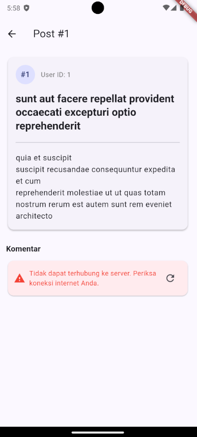

### refleksi

- Mengapa UI dilarang memanggil Dio langsung? Apa yang rusak jika aturan ini dilanggar?
    
    **dapat Merusak Separation of Concerns yang dapat menyulitkan testing UI dan membuat logika jaringan terduplikasi**

- Kapan pagination client-side cukup, dan kapan harus mengandalkan pagination server (_page/_limit)?
    
    **client-side untuk data kecil (< 500) dan statis**

    **server-side untuk data besar dan efisiensi memori/kuota**

- Bagaimana exception repository berubah menjadi AsyncError tanpa try/catch di setiap widget? Kapan try/catch eksplisit tetap dibutuhkan?
    
    **`AsyncValue.guard()` mengonversi exception otomatis di Notifier**

    **try/catch di UI hanya untuk umpan balik mutasi**